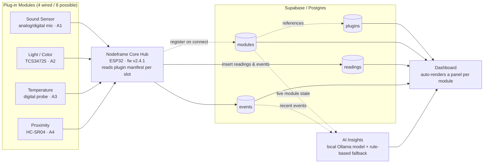

# Nodeframe

[](https://opensource.org/licenses/MIT)
[](#hardware--core-hub)

Nodeframe is a modular sensor framework built around an ESP32 core hub. Instead of a fixed set of sensors soldered to fixed roles, each sensor ships as a small **plugin manifest** describing its chip, metric, unit, and thresholds. Plug a module into any open slot, and the core hub reads the manifest, starts collecting, writes to a generalized Supabase backend, and the dashboard auto-renders a panel for it. No firmware rewrite, no schema migration, no redeploy.

## Where this stands for the hackathon

We pulled about six candidate sensors out of the lab for this build. The ESP32's power budget only lets us run **4 of them at once**, so 4 are physically wired to the demo rig right now and 4 more exist as complete, ready-to-wire plugin manifests — proof the architecture generalizes, not a fake sensor count. That's the actual pitch: swap the sensor, not the firmware, and we can show you the empty slots as easily as the full ones.

- **Live right now (4/8 slots):** Sound Sensor, Light/Color Sensor (TCS34725), Temperature, Proximity (HC-SR04) — see the [hardware table](#hardware--core-hub) below.
- **Manifest written, not wired (4/8 slots):** Gas Level (MQ-6), Access Control (MFRC522 RFID), Vibration (ADXL345), Soil Moisture — same schema, same install path, just waiting on a slot and a power budget.
- **New this pass:** an on-device AI Insights panel (local Ollama model, no API key) that turns the live sensor state into plain-English maintenance calls — "this is running hot," "this looks like sustained mechanical wear" — see [AI Insights](#ai-insights-local-via-ollama) below.

There's no fabricated "community marketplace" here — every plugin, installed or not, is authored by the team. We'd rather show four real, honestly-labeled sensors than eight we can't back up.

## Features

- **Hot-pluggable modules** — plug a sensor into any open slot on the core hub and it comes online without a reboot or firmware flash.
- **Plugin manifests** — every sensor type (chip, metric, unit, thresholds) is declared in a small manifest, not baked into firmware.
- **Generalized backend** — four Supabase tables (`plugins`, `modules`, `readings`, `events`) cover every sensor type that exists or will ever exist, replacing the old one-table-per-sensor design.
- **Auto-rendering dashboard** — reads `modules` and `readings` and builds a panel per module automatically; no per-sensor dashboard code.
- **AI Insights, on-device** — a local Ollama model reads live module state (status, trend, how long it's been flagged, recent events) and writes short maintenance insights; falls back to a deterministic rule-based generator if the model isn't running, so the panel never breaks.
- **Live on the demo rig right now**: the Sound Sensor has held a flat, elevated noise floor for ~25+ minutes (a sustained-plateau story, not a spike — the kind of thing that reads as mechanical wear), and Temperature has been drifting upward and just crossed its warning line. Both are visible in the module cards, the AI Insights panel, and the activity log at once.

## Architecture



When a module is plugged into a slot, the core hub reads that module's onboard EEPROM to identify which plugin it runs, loads the plugin's driver, and starts polling the sensor. Every reading is written to the shared `readings` table tagged with the metric key and unit from the plugin manifest, and threshold breaches or state changes are written to `events`. The dashboard queries `modules` joined against `plugins` to know what to render, then pulls the matching rows out of `readings` and `events` — a new sensor type never requires a dashboard code change, only a new plugin.

## Plugin manifest spec

A plugin manifest is what turns a wired-up chip into something the core hub and dashboard both understand. Here's the manifest for the Temperature module (slot A3), matching what's actually installed and reporting today:

```json
{
  "slug": "temperature",
  "name": "Temperature",
  "sensor_chip": "Digital temperature probe",
  "category": "Sensing",
  "metric_key": "temperature",
  "unit": "°C",
  "warn_above": 29,
  "crit_above": 33,
  "author": "nodeframe-core",
  "installed": true,
  "target_slot": "A3",
  "description": "Digital temperature probe on the core rig."
}
```

`metric_key` / `unit` tell the dashboard what to plot and label; `warn_above` / `crit_above` / `warn_below` / `crit_below` (only the relevant ones are set) drive the module's status color; `metric_key` and `unit` are nullable for event-only plugins that have no continuous reading to plot (Access Control is the one example in this build — it logs badge scans, not a metric series). `installed` and `target_slot` track whether the plugin is currently wired to a physical slot or just has a manifest waiting for one.

## Writing your first plugin

1. Write a manifest (`plugin.json`) — pick a `slug`, name your `metric_key` and `unit`, and set the thresholds that matter for your sensor.
2. Implement a driver function that reads the physical sensor and returns a value matching your `metric_key`:
   ```
   function read() {
     const raw = sensor.readRaw();
     return { metric_key: "lux", value: convertToLux(raw) };
   }
   ```
3. Register the plugin with the core (`nodeframe plugin install ./plugin.json`) and plug the module into an open slot.
4. The hub picks up the manifest on connect, starts polling via your driver, and the dashboard renders a new panel automatically — no other code to touch.

## Hardware — Core Hub

| Spec | Value |
| :--- | :--- |
| Core | Nodeframe Core Hub |
| MCU | ESP32 |
| Firmware | v2.4.1 |
| Slots | 8 total, in 3 groups: A1–A4, B1–B3, C1 |
| Slot bus | Shared I2C + one dedicated analog line + one dedicated digital line per slot |
| Module ID | Per-module EEPROM, read on connect for auto-identification |

Every slot accepts any plugin-described module — the split below is purely a power-budget cap on the hackathon rig, not a hardware limit.

**Wired and reporting right now (4):**

| Slot | Module | Sensor chip | Metric |
| :--- | :--- | :--- | :--- |
| A1 | Sound Sensor | Sound sensor module (analog/digital mic) | sound level (dB, relative) |
| A2 | Light / Color Sensor | TCS34725 (RGB color + ambient light) | lux |
| A3 | Temperature | Digital temperature probe | temperature (°C) |
| A4 | Proximity | HC-SR04 (Ultrasonic) | distance (cm) |

**Manifest written, not yet wired (4):**

| Target slot | Module | Sensor chip | Notes |
| :--- | :--- | :--- | :--- |
| B1 | Gas Level | MQ-6 (LPG/Propane) | Detects LPG/propane in ppm with a configurable safety-relay cutoff |
| B2 | Access Control | MFRC522 RFID | Badge-in/badge-out logging — event-based, not a continuous reading |
| B3 | Vibration | ADXL345 (accelerometer) | 3-axis RMS vibration monitoring |
| C1 | Soil Moisture | Capacitive probe | Proves the plugin format isn't industrial-only |

## AI Insights (local, via Ollama)

The dashboard has an **AI Insights** panel that reads live module state (status, trend direction, how long a sensor has been flagged, recent events) and writes short, plain-English maintenance calls — the "this machine needs repair" / "this is overheating" kind of read a technician would want at a glance.

It runs entirely on a locally hosted [Ollama](https://ollama.com) model — no API key, no external network call, so it keeps working even if the venue wifi doesn't. If Ollama isn't installed or isn't running, the panel automatically falls back to a deterministic rule-based generator, so it never breaks the demo — it just labels its source ("local model" vs. "rule-based fallback") honestly.

Setup:

1. Install Ollama: https://ollama.com/download
2. Pull a small, fast model: `ollama pull llama3.2`
3. Make sure it's serving (`ollama serve`, usually already running as a background service).
4. Copy `web/.env.example` to `web/.env.local` and adjust `OLLAMA_HOST` / `OLLAMA_MODEL` if your setup differs from the defaults (a stock local install needs no changes).

## Backend setup (Supabase)

1. Create a project at [supabase.com](https://supabase.com).
2. Go to the **SQL Editor** in your project dashboard.
3. Run [`seed/schema.sql`](seed/schema.sql) to create the four generalized tables (`plugins`, `modules`, `readings`, `events`). `plugins` now carries `installed boolean` and `target_slot text` instead of the old official/community/install-count fields, and `metric_key` / `unit` are nullable to support event-only plugins like Access Control.
4. Go to **Authentication → Policies** and disable **Row Level Security (RLS)** on all four tables so the core hub can insert with the `anon` key — fine for a hackathon demo, tighten before shipping past that.
5. Optionally run [`seed/seed_inserts.sql`](seed/seed_inserts.sql) to load realistic demo data — the 8 plugin manifests (4 installed, 4 not), the 4 installed modules, and their full reading history, including the Sound Sensor's sustained-plateau story and the Temperature warning-threshold crossing described above, so the dashboard has something real to show immediately.

## Web app

The marketing site and the operator dashboard are one Next.js 16 app in
[`web/`](web/) (App Router, TypeScript, Tailwind v4, React 19), reading from
the same seed data described above via `web/lib/data.ts`.

```bash
cd web
npm install
npm run dev      # http://localhost:3000        — marketing site
                  # http://localhost:3000/dashboard — operator console
```

`npm run build && npm run start` runs the production build. Fonts (Archivo,
IBM Plex Sans, IBM Plex Mono) are self-hosted via `@fontsource` — the app has
no runtime dependency on Google's font CDN, so it builds and demos fine on a
locked-down hackathon wifi.

```
web/
├─ app/
│  ├─ page.tsx              — marketing landing page ("/")
│  ├─ dashboard/page.tsx    — operator console ("/dashboard")
│  ├─ api/insights/route.ts — AI Insights endpoint (Ollama + rule-based fallback)
│  └─ globals.css           — design tokens (dark technical console theme)
├─ components/
│  ├─ marketing/            — landing page sections
│  └─ dashboard/            — module cards, charts, activity log, marketplace, AI Insights panel
└─ lib/
   ├─ data.ts               — typed accessors (seriesColorFor, computeStats, …)
   ├─ seed-data.json        — the same seed data as seed/seed_data.json
   └─ ai/                   — snapshot builder, rule-based heuristic, Ollama client
```

An earlier static-HTML iteration of both pages (`landing.html`,
`dashboard.html` at the repo root) is kept for reference; `web/` is the real
app going forward.

## Roadmap

- **Wire up the remaining 4 sensors** (Gas Level, Access Control, Vibration, Soil Moisture) as the power budget allows — the manifests already exist.
- **Public plugin registry** — a real submission process so anyone can publish and share a plugin.
- **Mobile companion app** — the dashboard's module cards and event log, in your pocket, with push alerts on warning/critical state changes.
- **AI Insights over history, not just snapshot** — feed the model a longer reading window instead of just current state, for earlier trend detection.
- **3D-printed modular enclosure** — one printable shell per slot group (A, B, C), so the physical build looks as modular as the software is.

## Contributing

Nodeframe grows by plugins, not pull requests to the core firmware — if you've got a sensor and a manifest, write it against the spec above, test it against your own core hub, and open a PR to add it to the marketplace listing.

## License

MIT
